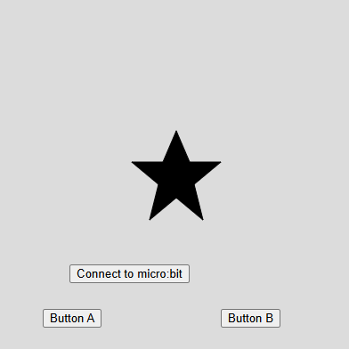

#### Desarrollo actividad 12

- Siguiendo la dinámica de los puntos anteriores, lo primero que hice fue coger los códigos dados en el punto 6 de la unidad e irlos modificando poco a poco hasta llegar a la solución de la actividad.

- Mi primera instrucción fue que al presionar los botones de la micro:bit; en vez de cambiar los colores como en el punto 6, cambiaran las formas. Esto, como una manera sencilla de irse acercando a la solución final. Este fue el prompt: "El siguiente código hace que al presionar uno de los botones de la tarjeta microbit, cambie el color del círculo en el programa. Sin embargo, quiero que ahora en vez de cambiar el color, se mantenga y cambie las formas por otros polígonos cuando se presionen los botones"




- Luego de esto, le pedí que cambiara la dinámica. En vez de usar los botones de la tarjeta micro:bit, le pedí que generara 2 botones. Este fue el prompt: "bien, ahora quiero que lo modifiques haciendo que hayan 2 botones virtuales al ejecutar el programa y que cambie la forma pero de los leds de la micro:bit". Este fue el código:

```js
let port;
let connectBtn;
let buttonA, buttonB;
let currentShape = 0;  // Variable para llevar el control de la forma

// Lista de formas (puedes agregar más formas si lo deseas)
const shapes = ['circle', 'square', 'triangle', 'star'];

function setup() {
    createCanvas(400, 400);
    background(220);
    
    // Conexión con el puerto serie
    port = createSerial();
    connectBtn = createButton('Connect to micro:bit');
    connectBtn.position(80, 300);
    connectBtn.mousePressed(connectBtnClick);
    
    // Botones virtuales en la pantalla para cambiar la forma
    buttonA = createButton('Button A');
    buttonA.position(50, 350);
    buttonA.mousePressed(() => changeShape('A'));
    
    buttonB = createButton('Button B');
    buttonB.position(250, 350);
    buttonB.mousePressed(() => changeShape('B'));
    
    // Inicializa la forma
    fill('white');
    drawShape(currentShape);  // Dibuja la forma inicial
}

function draw() {

    if (port.availableBytes() > 0) {
        let dataRx = port.read(1);
        if (dataRx == 'A' || dataRx == 'B') {
            currentShape = (currentShape + 1) % shapes.length;  // Cambia la forma
            sendShapeToMicrobit();  // Enviar la forma a la micro:bit
        }
    }

    if (!port.opened()) {
        connectBtn.html('Connect to micro:bit');
    } else {
        connectBtn.html('Disconnect');
    }
}

// Función para cambiar la forma
function changeShape(button) {
    // Cambiar la forma según el botón presionado
    currentShape = (currentShape + 1) % shapes.length;  // Cambia la forma
    sendShapeToMicrobit();  // Enviar la forma a la micro:bit
}

// Función para enviar la forma actual a la micro:bit
function sendShapeToMicrobit() {
    // Según la forma seleccionada, enviamos una señal a la micro:bit para actualizar los LEDs
    switch (shapes[currentShape]) {
        case 'circle':
            port.write('C');  // Enviar "C" para círculo
            break;
        case 'square':
            port.write('S');  // Enviar "S" para cuadrado
            break;
        case 'triangle':
            port.write('T');  // Enviar "T" para triángulo
            break;
        case 'star':
            port.write('X');  // Enviar "X" para estrella
            break;
    }
}

// Función para conectar o desconectar la micro:bit
function connectBtnClick() {
    if (!port.opened()) {
        port.open('MicroPython', 115200);
    } else {
        port.close();
    }
}
```
- Luego, le pedí que corrigiera algunos errores como esta línea que la función no estaba definida:

```js
drawShape(currentShape);
```

- Finalmente, me dí cuenta que para que los botones controlen los leds para hacer unas imagenes específicas; era necesario añadir código también a MicroPython que establece la conexión entre el PC y la tarjeta micro:bit. Estos fueron los códigos finales de la solución:

- **Código p5.js:**

[Enlace al proyecto](https://editor.p5js.org/JoseDRP/sketches/z9KCdoDOi)
```js
let port;
let connectBtn;
let buttonA, buttonB;
let currentShape = 0;  // Variable para llevar el control de la forma

// Lista de formas (puedes agregar más formas si lo deseas)
const shapes = ['circle', 'square', 'triangle', 'star'];

function setup() {
    createCanvas(400, 400);
    background(220);
    
    // Conexión con el puerto serie
    port = createSerial();
    connectBtn = createButton('Connect to micro:bit');
    connectBtn.position(80, 300);
    connectBtn.mousePressed(connectBtnClick);
    
    // Botones virtuales en la pantalla para cambiar la forma
    buttonA = createButton('Button A');
    buttonA.position(50, 350);
    buttonA.mousePressed(() => changeShape('A'));
    
    buttonB = createButton('Button B');
    buttonB.position(250, 350);
    buttonB.mousePressed(() => changeShape('B'));
    
    // Inicializa la forma
    fill('white');
    drawShape(currentShape);  // Dibuja la forma inicial
}

function draw() {

    if (port.availableBytes() > 0) {
        let dataRx = port.read(1);
        if (dataRx == 'A' || dataRx == 'B') {
            currentShape = (currentShape + 1) % shapes.length;  // Cambia la forma
            sendShapeToMicrobit();  // Enviar la forma a la micro:bit
        }
    }

    if (!port.opened()) {
        connectBtn.html('Connect to micro:bit');
    } else {
        connectBtn.html('Disconnect');
    }
}

// Función para cambiar la forma
function changeShape(button) {
    // Cambiar la forma según el botón presionado
    currentShape = (currentShape + 1) % shapes.length;  // Cambia la forma
    sendShapeToMicrobit();  // Enviar la forma a la micro:bit
    drawShape(currentShape);  // Dibuja la forma en el canvas
}

// Función para dibujar la forma
function drawShape(shapeIndex) {
    background(220);  // Limpiar la pantalla antes de dibujar la nueva forma
    fill('black');
    switch (shapes[shapeIndex]) {
        case 'circle':
            ellipse(width / 2, height / 2, 100, 100);  // Círculo
            break;
        case 'square':
            rect(width / 2 - 50, height / 2 - 50, 100, 100);  // Cuadrado
            break;
        case 'triangle':
            triangle(width / 2 - 50, height / 2 + 50, width / 2 + 50, height / 2 + 50, width / 2, height / 2 - 50);  // Triángulo
            break;
        case 'star':
            beginShape();
            vertex(width / 2, height / 2 - 50);
            vertex(width / 2 + 15, height / 2 - 15);
            vertex(width / 2 + 50, height / 2 - 15);
            vertex(width / 2 + 20, height / 2 + 10);
            vertex(width / 2 + 30, height / 2 + 50);
            vertex(width / 2, height / 2 + 25);
            vertex(width / 2 - 30, height / 2 + 50);
            vertex(width / 2 - 20, height / 2 + 10);
            vertex(width / 2 - 50, height / 2 - 15);
            vertex(width / 2 - 15, height / 2 - 15);
            endShape(CLOSE);  // Estrella
            break;
    }
}

// Función para enviar la forma actual a la micro:bit
function sendShapeToMicrobit() {
    // Según la forma seleccionada, enviamos una señal a la micro:bit para actualizar los LEDs
    switch (shapes[currentShape]) {
        case 'circle':
            port.write('C');  // Enviar "C" para círculo
            break;
        case 'square':
            port.write('S');  // Enviar "S" para cuadrado
            break;
        case 'triangle':
            port.write('T');  // Enviar "T" para triángulo
            break;
        case 'star':
            port.write('X');  // Enviar "X" para estrella
            break;
    }
}

// Función para conectar o desconectar la micro:bit
function connectBtnClick() {
    if (!port.opened()) {
        port.open('MicroPython', 115200);
    } else {
        port.close();
    }
}
```

- **Código MicroPython:**

```py
from microbit import *

# Inicializa el UART con la misma velocidad de baudios
uart.init(baudrate=115200)

# Muestra una mariposa en la pantalla al inicio
display.show(Image.BUTTERFLY)

# Funciones para dibujar las diferentes formas
def draw_circle():
    display.clear()
    display.set_pixel(2, 2, 9)  # Dibuja un círculo en el centro

def draw_square():
    display.clear()
    display.set_pixel(1, 1, 9)
    display.set_pixel(1, 3, 9)
    display.set_pixel(3, 1, 9)
    display.set_pixel(3, 3, 9)

def draw_triangle():
    display.clear()
    display.set_pixel(2, 0, 9)
    display.set_pixel(1, 1, 9)
    display.set_pixel(3, 1, 9)
    display.set_pixel(2, 2, 9)

def draw_star():
    display.clear()
    display.set_pixel(0, 2, 9)
    display.set_pixel(4, 2, 9)
    display.set_pixel(2, 0, 9)
    display.set_pixel(2, 4, 9)
    display.set_pixel(1, 1, 9)
    display.set_pixel(3, 1, 9)
    display.set_pixel(1, 3, 9)
    display.set_pixel(3, 3, 9)

# Bucle principal
while True:
    # Detecta si se presionan los botones A y B, o si se detecta el gesto de sacudida
    if button_a.is_pressed():
        uart.write('A')  # Enviar 'A' al navegador
        sleep(500)
    if button_b.is_pressed():
        uart.write('B')  # Enviar 'B' al navegador
        sleep(500)
    if accelerometer.was_gesture('shake'):
        uart.write('C')  # Enviar 'C' al navegador
        sleep(500)
    
    # Recibe datos del navegador
    if uart.any():
        data = uart.read(1)
        if data:
            if data[0] == ord('C'):
                draw_circle()  # Mostrar círculo en la pantalla
            elif data[0] == ord('S'):
                draw_square()  # Mostrar cuadrado en la pantalla
            elif data[0] == ord('T'):
                draw_triangle()  # Mostrar triángulo en la pantalla
            elif data[0] == ord('X'):
                draw_star()  # Mostrar estrella en la pantalla
            elif data[0] == ord('h'):
                display.show(Image.HEART)  # Muestra un corazón si recibe 'h'
                sleep(500)
                display.show(Image.HAPPY)  # Luego muestra una cara feliz
```
